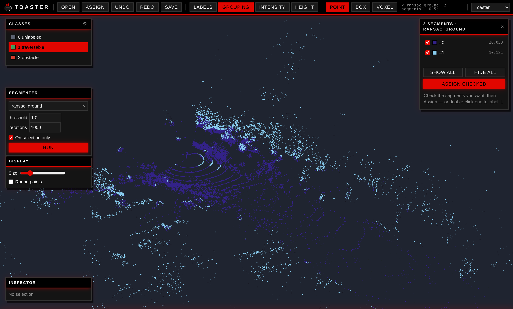

<div align="center">


# Toaster

**Annotate lidar point clouds in 3D — run a model, click one cluster, label the whole group at once.**

[](https://github.com/augustin-bresset/toaster/actions/workflows/ci.yml)
[](LICENSE)
[](pyproject.toml)
[](https://github.com/astral-sh/ruff)
[](https://huggingface.co/spaces/SmaugC137/toaster)

[**▶ Live demo**](https://huggingface.co/spaces/SmaugC137/toaster) · [**Sibling tool: Splasher**](https://github.com/augustin-bresset/splasher) · [Quick start](#install)

</div>

<p align="center">
  
</p>

Annotate lidar **point clouds** in 3D — walk through them, select points one by
one or by zone, assign semantic classes — and, its headline feature, **plug in
any model that groups points together** (clustering like DBSCAN, or neural-net
inference) so that **clicking one cluster labels the whole group at once**.

## The idea in one picture

A clustering/segmentation model and a manual zone selection are the *same thing*:
both produce **groups of points**. So Toaster keeps two layers strictly apart:

| Layer | Object | Nature |
|---|---|---|
| Grouping | `Grouping` (`group_id`, `-1` = noise) | **transient**, produced by a model, disposable |
| Annotation | `labels` (one class per point) | **persistent** — the only thing saved |

`Selection` is the bridge: `Grouping → Selection → labels`. Run a segmenter to
get a grouping, click a cluster to select its whole group, assign a class.

## Install

```bash
git clone https://github.com/augustin-bresset/toaster && cd toaster
uv venv && uv pip install -e ".[dev]"     # or: pip install -e ".[dev]"
```

Optional extras: `csf` (CSF ground detection), `hdbscan`, `open3d` (robust
`.pcd`), `apairo` (load apairo datasets), `models` (ONNX), `torch`, `viewer3d`
(legacy PyVista backend).

## Run the app

> **Try it online first** — a live demo runs on
> [🤗 Hugging Face Spaces](https://huggingface.co/spaces/SmaugC137/toaster), no install required.

`toaster` opens a **native desktop window** (the web UI in a pywebview shell);
`toaster-web` serves the **same UI for a plain browser**.

```bash
python examples/make_sample.py     # writes examples/sample.bin
toaster examples/sample.bin        # native window — or .ply / .las / .laz / .pcd
toaster-web                        # no file? a file browser opens; UI at http://127.0.0.1:8000
```

Launched **without a path**, a built-in file browser opens on the working
directory: click into folders, or type a path with **Tab**-completion.

### Select and label

- **Point** mode: click a point to select it — the whole cluster if a grouping
  is active. **Shift** adds, **Ctrl** subtracts.
- **Box** mode: drag a box; it stays drawn so you can **double-click inside it**
  to label the whole box. (Right-drag still orbits the camera.)
- **Voxel** mode: a transparent grid of occupied cells; click one to select its
  points (cell size is configurable).
- **Label in one gesture**: **double-click** (left *or* right) a cluster, point,
  voxel, or box to stamp the **active class** — no separate Assign step.
- Or select, then **Assign** (toolbar) / **Enter** / the number key shown beside
  the class. **Ctrl+Z / Ctrl+Shift+Z** undo/redo. **Save** writes labels beside
  the cloud (`<cloud>.toaster.npy`), restored on reopen.

### Segment, then label whole clusters

The *Segmenter* panel runs a model (optionally scoped to the current selection);
the result becomes the active **grouping**. The *Segments* window lists each
group — toggle a group's visibility (hidden ones grey out, while points you have
**already labelled keep their class colour**), **Assign checked** labels every
visible group at once, or double-click a group to label just it. Closing the
window discards the grouping; the labels it helped produce stay.

Built-in segmenters: clustering — `dbscan`, `hdbscan`, `kmeans`, `kmedoids`,
`agglomerative`, `optics`, `meanshift`; ground detection — `ransac_ground`,
`ground_grid`, `csf` (with the `csf` extra). Heavy clusterers stay usable on
large clouds by clustering a bounded subsample, then assigning the rest to the
nearest cluster.

### Classes, display, themes

- The *Classes* panel (+ its ⚙ manager) adds / renames / recolours / removes
  classes; the highlighted one is the active brush.
- Colour the cloud by **Labels / Grouping / Intensity / Height**; tune point size.
- Three themes, top-right — **Toaster**, **Café Toaster**, **Arcade Quest** — each
  with its own animated logo.

## Use it as a library (headless)

`toaster.core` is numpy-only and never imports a GUI, so it works in a script or
a pipeline:

```python
import numpy as np
from toaster.io import load_cloud
from toaster.core import Selection, AnnotationController
from toaster.segment import get_segmenter

cloud = load_cloud("scan.ply")
cloud.ensure_labels()

# Cluster, then label whole clusters programmatically.
grouping = get_segmenter("dbscan", eps=0.4, min_samples=12).segment(cloud)
ann = AnnotationController(cloud)             # the single writer of cloud.labels
for gid in grouping.group_ids():
    ann.assign(Selection.from_group(grouping, gid), class_id=4)   # e.g. "vehicle"

np.save("scan.labels.npy", cloud.labels)
```

## Extend it — the two seams

**A custom segmenter** (anything that groups points):

```python
from toaster.segment import register_segmenter, scatter
from toaster.segment.base import resolve_points

@register_segmenter
class SliceByHeight:
    name = "height_slices"
    def __init__(self, step: float = 1.0):
        self.step = step
    def segment(self, cloud, selection=None):
        xyz, indices = resolve_points(cloud, selection)
        group_ids = (xyz[:, 2] / self.step).astype(int)
        return scatter(group_ids, indices, cloud.n, source=self.name)
```

**I already have a Python model that labels points.** One call registers it as a
named segmenter — its predicted classes become groups *and* `suggested_labels`:

```python
# my_segmenters.py
from toaster.segment import register_model
import my_net

def predict(points):           # points is (M, 3+F); returns (M,) class ids
    return my_net.run(points)  # torch / ONNX / sklearn — anything

register_model("my_net", predict, feature_keys=["intensity"], ignore_id=0)
```

In a script, import the module then `get_segmenter("my_net")`. To surface it in
the app, import it at launch with `--plugin`:

```bash
toaster scan.ply --plugin my_segmenters       # native window
toaster-web --plugin my_segmenters            # browser
```

**A custom loader** (a new file format):

```python
from toaster.io import register_loader
from toaster.core import PointCloud

class XyzLoader:
    extensions = (".xyz",)
    def load(self, path):
        import numpy as np
        return PointCloud(xyz=np.loadtxt(path, dtype="float32")[:, :3], source=path)

register_loader(XyzLoader())
```

## Architecture

```
toaster/
  core/         domain — numpy-only, headless, 100% unit-tested
  io/           pluggable loaders (registry): .ply/.bin/.las/.laz/.pcd (+apairo)
  segment/      pluggable segmenters (registry): clustering + ground detection
  persistence/  label / schema / session sidecars
  interaction/  headless controller (select -> assign workflow) + flat snapshot
  api/          FastAPI service + REST app + numpy wire codec        # toaster-web
  web/          vanilla Three.js front-end (no build step)
  desktop.py    native window via pywebview                          # toaster
  viewer/       optional PyVista backend behind a Viewer protocol    # viewer3d extra
```

Dependency rule: `core` depends on nothing; `io / segment / persistence` depend
only on `core`; `interaction` glues `core` to a `Viewer` protocol but stays
headless (the web build drives it through a `NullViewer`); `api` + `web` are the
front-end. The browser only ever receives numpy arrays and a flat snapshot —
never colour buffers — so the renderer is fully client-side and replaceable.

## Sibling project — Splasher

**[Splasher](https://github.com/augustin-bresset/splasher)** is Toaster's sibling,
built on the same foundation (a numpy-only core with a shared web + native-desktop
front). Where Toaster does **3D semantic segmentation** of a single cloud, Splasher
labels **synchronized multi-channel datasets** (lidar + camera + pose) into a
top-down **BEV grid** or per-point labels — aimed at robotics / traversability.

Same house, different task: reach for **Toaster** to segment and label points in 3D,
for **Splasher** when you have synchronized sensors and want a bird's-eye labeling grid.

## Development

```bash
make check     # ruff (lint + format) + pytest — the same checks CI runs
```

CI runs lint, the format check and the test suite on Python 3.11 and 3.12 for
every push and pull request. Contributions are welcome — see
[CONTRIBUTING.md](CONTRIBUTING.md).
